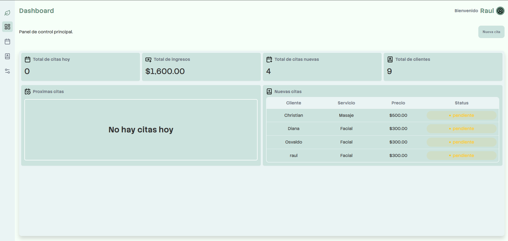
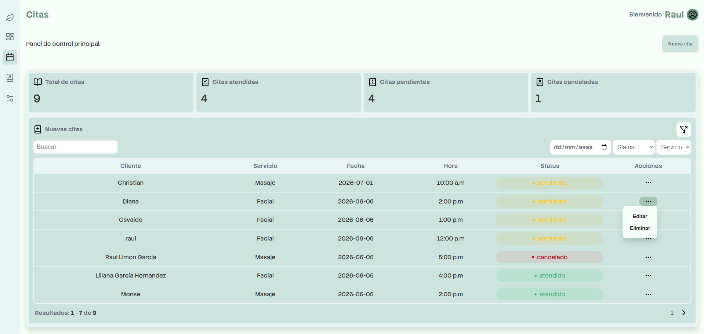
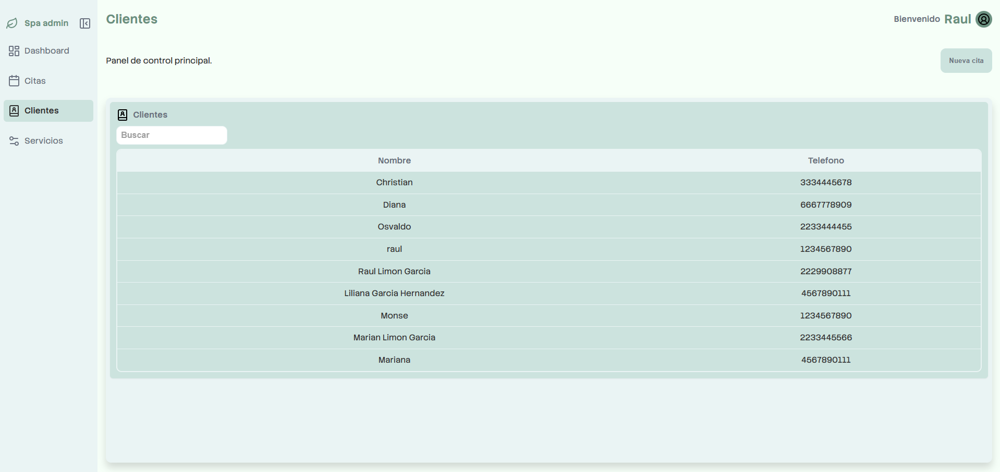
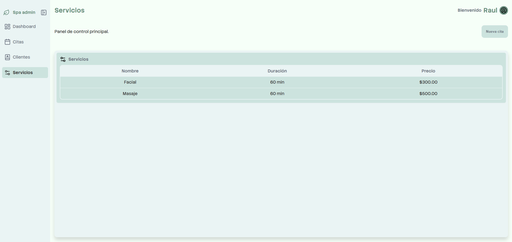
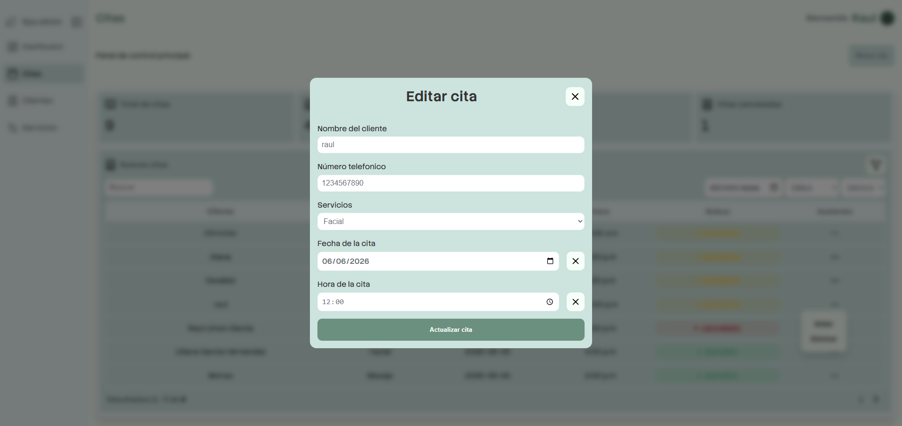
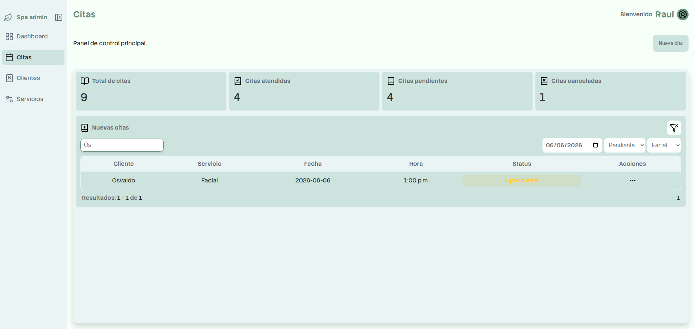
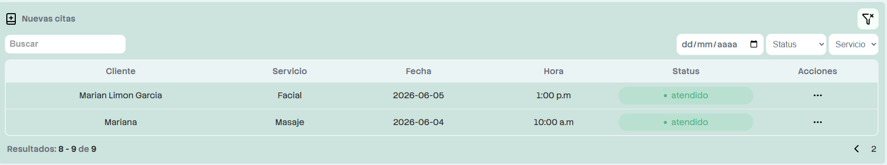

# 💆 SPA Booking Dashboard

A responsive administrative dashboard for managing a spa's appointments and clients, built with **HTML, CSS, and Vanilla JavaScript** using **Vite**.

This project was built as part of my frontend portfolio to practice modular JavaScript architecture, reusable UI components, DOM manipulation, client-side filtering, and pagination without using frontend frameworks.

---

## 🚀 Live Demo

🔗 https://spa-booking-dashboard.vercel.app/

---

## 📸 Screenshots

### Dashboard



### Appointments



### Clients



### Services



### Edit Appointment



### Filters



### Pagination



---

## ✨ Features

### UI

- Responsive layout
- Reusable cards
- Reusable tables
- Reusable pagination
- Reusable dropdown menus
- Modal dialogs

### Dashboard

- Appointment statistics
- Summary cards
- Responsive layout

### Appointments

- Dynamic appointments table
- Search appointments by client name
- Filter appointments by:
  - Date
  - Status
  - Service
- Client-side pagination
- Edit appointments
- Delete appointments
- Reusable dropdown actions

### Clients

- Dynamic client table
- Client search

---

## 🛠 Tech Stack

- HTML5
- CSS3
- JavaScript (ES6 Modules)
- Vite

---

## 📁 Project Structure

```
spa-booking-dashboard/
│
├── docs/
│   ├── dashboard.png
│   ├── appointments.png
│   ├── clients.png
│   ├── services.png
│   ├── edit-appointment.png
│   ├── filters.png
│   └── pagination.png
│
├── public/
│
├── src/
│   ├── assets/
│   │   ├── fonts/
│   │   ├── headings/
│   │   ├── icons/
│   │   ├── images/
│   │   └── texts/
│   │
│   ├── js/
│   │   ├── components/
│   │   │   ├── modals/
│   │   │   ├── cards.js
│   │   │   ├── columns.js
│   │   │   ├── dropdown.js
│   │   │   ├── forms.js
│   │   │   ├── navbar.js
│   │   │   ├── pagination.js
│   │   │   └── tables.js
│   │   │
│   │   ├── modules/
│   │   ├── service/
│   │   ├── utils/
│   │   ├── app.js
│   │   └── main.js
│   │
│   └── styles/
│       ├── base/
│       ├── components/
│       ├── layout/
│       └── main.css
│
├── .gitignore
├── index.html
├── package-lock.json
├── package.json
└── README.md
```

---

## 🏗 Architecture

The application follows a modular architecture with reusable components, making it easier to maintain and scale.

### Components

Reusable UI elements such as:

- Cards
- Tables
- Dropdowns
- Pagination
- Forms
- Navigation
- Modals

### Services

Contains the application's business logic:

- Searching
- Filtering
- Pagination
- Local storage management

### Modules

Responsible for rendering each dashboard view and handling user interactions.

### Utils

Shared helper functions used throughout the project.

---

## 🎯 Learning Objectives

This project was built to improve skills in:

- DOM manipulation
- ES Modules
- Frontend architecture
- Component-based development
- Separation of concerns
- State management
- Reusable UI components
- Clean code practices

---

## 🔮 Future Improvements

- Authentication
- Client CRUD
- Service CRUD
- REST API integration
- Dashboard charts
- Mobile optimizations
- Backend persistence
- User authentication
- Dark mode
- API integration
- Export appointments
- Dashboard analytics

---

## ⚙️ Getting Started

### Clone the repository

```bash
git clone https://github.com/RaulLimon3/spa-booking-dashboard.git
```

### Install dependencies

```bash
npm install
```

### Start the development server

```bash
npm run dev
```

### Build for production

```bash
npm run build
```

### Preview the production build

```bash
npm run preview
```

---

## 👨‍💻 Author

Developed by **Raúl Limón**  
Frontend Developer focused on building scalable and maintainable web applications while continuously improving JavaScript and frontend architecture skills.

- GitHub: [RaulLimon3](https://github.com/RaulLimon3)  
- LinkedIn: [Raúl Limón]https://www.linkedin.com/in/raul-limon-garcia/

---

## 📄 License

This project was created for educational purposes and portfolio demonstration.